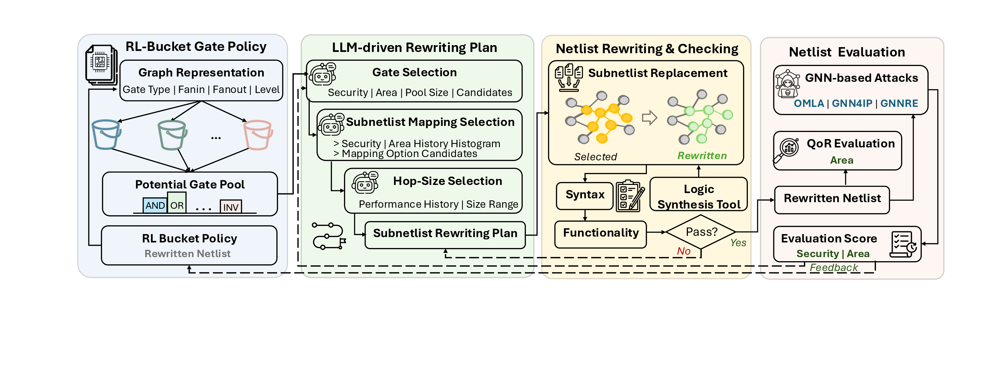

# NetDeTox

**Adversarial and Efficient Evasion of Hardware-Security GNNs via RL-LLM Orchestration**

> **Accepted to DAC 2026.** Preprint: [arXiv:2512.00119](https://arxiv.org/abs/2512.00119) ([PDF](https://arxiv.org/pdf/2512.00119)).

Initial open release (OMLA attack).

<p align="center">
  
</p>

**NetDeTox** rewrites a synthesized, logic-locked gate-level netlist so that a
GNN-based hardware-security attack can no longer succeed — while keeping the
circuit logically equivalent and adding little area. An LLM proposes which gate
families and sub-cones to touch, a lightweight RL policy allocates the
optimization budget, and an ABC / Circuit-Transformer **sub-circuit optimizer**
performs equivalence-preserving local resynthesis. After every edit the netlist
is re-attacked; the design that most weakens the attacker is kept.

This is the **initial open release** for our DAC submission. It is primarily a
**code release of the NetDeTox framework**, shipped with the **OMLA** attacker
(oracle-less ML attack on logic locking) wired in and runnable out of the box.
The framework is attack-agnostic: other attackers (GNN4IP, GNN-RE, TrojanSAINT,
…) plug in behind the same `--eval_backend` interface, so users who need them can
add their own. A small set of **example de-toxified designs (GPT-5 backend)** is
included to demonstrate the effect.

> Internally the framework was prototyped as *DraGON*; some source files still
> use that / `llm_exo` naming.

---

## What's in this release

```
netdetox-omla-release/
├── README.md
├── code/                           ← the NetDeTox framework  (main deliverable)
│   ├── drivers/netdetox_omla.py    ← main loop (--eval_backend omla)
│   ├── ablations/                  ← netdetox_omla_noLLM.py / _noRL.py
│   ├── optimizer/                  ← equivalence-preserving resynthesis
│   │   ├── subcircuit_opt.py       ← ABC/Yosys sub-cone optimizer + CEC check
│   │   ├── subcircuit_opt_new.py
│   │   ├── circuit_agent.py        ← Circuit-Transformer driver
│   │   └── ct_example.py/.sh
│   ├── assets/                     ← Nangate45 .lib + pretrained RL policies
│   ├── analysis/                   ← log → CSV extractors
│   ├── scripts/run_OMLA_c1355.sh   ← example SLURM launcher
│   └── requirements.txt
├── attacker/
│   └── OMLA/                        ← the OMLA attacker, runnable (trimmed to essentials)
│       ├── launch_omla_test_specify.py   ← entrypoint the driver calls
│       ├── Main_omla_test.py             ← get_omla_key_acc_ori(...)
│       ├── util.py, util_functions.py    ← graph/subgraph helpers (S2VGraph)
│       ├── models/graphcnn.py, mlp.py    ← GNN attacker model
│       ├── netlist_to_subgraphs.pl,      ← netlist → subgraph featurization
│       │   netlist_to_subgraph_test.pl, theCircuit.pm
│       └── data/<circuit>_{test,tmp}/    ← per-circuit pretrained attacker weights
├── benchmarks/                      ← locked source netlists (pre-defense)
│   └── locked_c1355 / c1908 / c2670 / c3540 .v
├── designs/
│   └── GPT-5/                       ← 4 example de-toxified netlists (one per circuit)
│                                       + .report.json edit set for each
└── results/
    ├── manifest.csv                 ← the 4 designs → source + OMLA acc + area
    ├── results_consolidated.csv     ← GPT-5 per-circuit baseline vs best
    └── all_info/omla_gpt5.csv       ← full per-iteration trajectory
```

The example designs use the **GPT-5** backend, one netlist per locked benchmark.
To produce designs with any other LLM backend (GPT-4o-mini, Gemini, LLaMA-4,
Qwen-3, DeepSeek-V3) or the `noLLM` / `noRL` ablations, run the driver with that
backend — the code and the bundled attacker regenerate them directly.

---

## Example result (GPT-5 backend)

OMLA key-bit prediction accuracy — **0.5 = random guessing = attack defeated**
(lower is better; from `results/manifest.csv`):

| Locked circuit | OMLA baseline | NetDeTox (GPT-5) | Area overhead |
|----------------|--------------:|-----------------:|--------------:|
| c1355 | 0.696 | **0.489** | +50% |
| c1908 | 0.553 | **0.463** | +35% |
| c2670 | 0.719 | **0.493** | +9% |
| c3540 | 0.761 | **0.493** | +26% |

Every design is combinationally equivalent to its source netlist (ABC `cec`
verified during the run); each `.report.json` lists the exact instances
removed/inserted, so the edit is auditable.

---

## How a run works

```
locked netlist ─┐
                ▼
        ┌───────────────────────────────────────────────┐
        │  for each iteration:                            │
        │   1. LLM picks gate family + candidate sub-cone │  code/drivers/netdetox_omla.py
        │   2. RL policy sets k / budget per bucket       │  code/assets/rl_*.json
        │   3. equivalence-preserving resynthesis         │  code/optimizer/subcircuit_opt.py
        │   4. ABC cec  →  verify logic unchanged          │
        │   5. re-run the attacker  →  security score      │  attacker/OMLA
        │   6. keep design if the attacker got weaker      │
        └───────────────────────────────────────────────┘
                ▼
        best (lowest-attacker-success) netlist  →  designs/
```

The attacker is invoked behind a single interface — `scores_of(netlist,
eval_backend=...)` in the driver. For OMLA it runs
`python launch_omla_test_specify.py --work_dir ... --circuit_name ... --iter N`
inside `attacker/OMLA` (default conda env `iplock`, `FIXED_OMLA_ENV`) and parses
the reported key-accuracy. To support another attack, drop in an evaluator that
exposes the same "netlist → score" call and select it with `--eval_backend`.

---

## Reproduce a run

From `code/`:

```bash
export OPENAI_MODEL=gpt-5            # or gpt-4o-mini; use the _gemini/_others driver for other backends
export OPENAI_API_KEY=...
export PATH=$PATH:/path/to/yosys:/path/to/iverilog/bin
module load abc                       # ABC must be on PATH

python drivers/netdetox_omla.py \
    --netlist ../benchmarks/locked_c1355.v \
    --work_dir tmp_c1355 \
    --circuit_name c1355 \
    --max_iters 50 --eval_backend omla
```

At `run_end` the log records `final_netlist_security` — that file is the
de-toxified design. To score any netlist directly with the bundled attacker:

```bash
cd attacker/OMLA
python launch_omla_test_specify.py \
    --work_dir <dir with the netlist staged> --circuit_name c1355 --batch_size 64
```

---

## Requirements

- Python 3.9+, `networkx`, `pyverilog`, `requests`, `numpy` (framework);
  `torch` + `torch-geometric`, `scikit-learn`, `pandas` (OMLA attacker). See
  `code/requirements.txt`.
- External EDA tools on `PATH`: **ABC**, **Yosys**, **Icarus Verilog**.
- Optional `circuit_transformer` (`pip install circuit-transformer`) for the
  neural resynthesis path; the ABC path works without it.
- An LLM API key for the chosen backend. The `noLLM` ablation needs no key.

The bundled OMLA attacker includes per-circuit pretrained weights, so the
defense loop and re-scoring run out of the box.

---

## Paper figures

Figures from the paper are in [`figures/`](figures/):

| File | Content |
|------|---------|
| `framework.pdf` | NetDeTox framework overview |
| `motivation-new.pdf` | Motivation |
| `gnnip_violin.pdf` | GNN4IP results | 
| `gnnre_violin.pdf` | GNN-RE results |
| `ablation.pdf` | LLM / RL ablation |
| `hopsize.pdf` | Effect of hop size *k* |
| `mapping.pdf` | Technology-mapping study |
| `planning_order.pdf` | Planning-order study |

---

## Citing

If you use this code or the example designs, please cite the NetDeTox paper
(accepted to DAC 2026). Preprint: [arXiv:2512.00119](https://arxiv.org/abs/2512.00119).

```bibtex
@article{wang2025netdetox,
  title={NetDeTox: Adversarial and Efficient Evasion of Hardware-Security GNNs via RL-LLM Orchestration},
  author={Wang, Zeng and Shao, Minghao and Saha, Akashdeep and Karri, Ramesh and Knechtel, Johann and Shafique, Muhammad and Sinanoglu, Ozgur},
  journal={arXiv preprint arXiv:2512.00119},
  year={2025}
}
```
